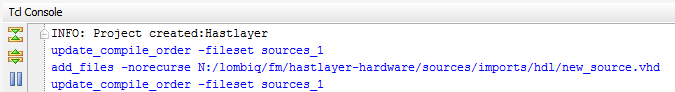

# Getting started

The purpose of this document is to get you started with the following topics:

- generating and opening the Vivado project (which can be used to generate the bitstream for the FPGA),
- generating and opening the SDK workspace (which contains the software projects to be run on the MicroBlaze soft CPU core),
- using version control.

We use the TCL-based approach for keeping a minimum set of required files under version control.

## Generating the Vivado project with batch file (mkproject.bat)

Run `mkproject.bat` which will open Vivado, and generate the project files in the `project` subdirectory.

Once the project has been generated, you can re-open it next time by entering the `project` subdirectory and opening `Hastlayer.xpr`.

> The project subdirectory will not be checked into version control, it only contains all the temporary files needed for editing and compiling the project and its corresponding IP cores.

## Generating the Vivado project manually

If the *Create file associations* option is not selected while installing Vivado, `mkproject.bat` might not work. In any case, you can open Vivado and type the following into the TCL console to open the project:

    cd C:/path-to-my-project/hastlayer-hardware
    source mkproject.tcl

(Do not forget that we have to use the slash '/' inside the paths here, instead of the Windows default backslash.)

## Generating the SDK workspace with batch file (mksdk.bat)

To start the Xilinx SDK, you will have to *Generate bitstream* in Vivado, wait until the process ends, and choose *Export → Export Hardware*.
In the dialog that appears, choose the `SDK` folder in the root of the repository, then click OK.

For the first time, you will have to run `mksdk.bat` from the root of the repository, which will create the workspace in the `sdk` directory, and it will also import the projects into it.

Close any program that may lock the SDK folder, including Explorer, if you receive the following error:

    Moving SDK folder...
    Access is denied.
            0 dir(s) moved.

You should run `mksdk.bat` only once. The next time you can open the workspace by launching Xilinx SDK from Vivado (but make sure you have set the directories correctly):

You will have to press OK at the Xilinx SDK *Workspace Launcher* screen, and then close the welcome screen:

Now you are ready to develop with the Xilinx SDK:

If you run into problems while building a project, try this:
1. Right click on the project in *Project Explorer*.
2. Select *Change Referenced BSP*.
3. Select *Hastlayer_bsp* in the popup window.
4. Press OK.
5. Clean and rebuild the project.

## Generating the SDK workspace manually

If `mksdk.bat` accidentally fails, you create the workspace manually:

Launch Xilinx SDK from Vivado, selecting the the `sdk` folder as your workspace.

Import the projects:

If you get a lot of build errors, you have to set the references for each project correctly.

- All of the application projects (including `HastlayerOperatingSystem`) should have to reference the BSP.
- The BSP has to reference the Hardware Platform.

	HastlayerOperatingSystem  \
	Ethernet_cpp              ----- >  Hastlayer BSP ---> Hastlayer Hardware Platform
	Ethernet_bare_cpp         /

To do this, right click on each and every application project, and select *Change referenced BSP*, then click OK.

Then right click the BSP project and open up the *Properties* window for it:

On the *Project References* page, check the reference for `Hastlayer_wrapper_hw_platform_0` (and uncheck all others).

Right click the BSP project and *Re-generate BSP Sources*:

Then clean all projects, and re-build them. The errors should be gone.

## Version control

The TCL-based approach to keep the minimum set of files under version control has been selected because the XPR project and its associated files change frequently (even from opening and recompiling the project).

### Committing changes
You have to take different actions when different parts of the project change:

- If the files or ports of Hast IP change, you will have to regenerate `component.xml` by repackaging the IP core in the Vivado subproject of the IP core.
- If the block design changes (IP cores are added/removed or the topology changes):
    - Open the block design in Vivado
    - Select *File → Export → Export Block Design*
    - Change the export path to overwrite the existing mkbd.tcl in the root of the repo. For example: change from *N:/lombiq/fm/hastlayer-hardware/project/Hastlayer.tcl* to *N:/lombiq/fm/hastlayer-hardware/mkbd.tcl*.
- If new files have been added to the project itself, you first have to check the Vivado TCL window in order to see the executed TCL commands, and add these to the `mkproject.tcl` file manually. Let's see an example:
    - We're adding a file called `new_source.vhd` to our project through the *Add Sources* wizard of Vivado.  
    
    - We see this in the TCL console:  
    
    - We add the file to the project by adding the correct command to `mkproject.tcl`:  
    
- If the C/C++ project changes in the SDK, you have nothing to do.

### Pulling changes
- If *mkbd.tcl* or *mkproject.tcl* changes you have to delete the *Project* folder and re-run *mkproject.bat*. If anything else changes in the hardware design then you'll just need to regenerate the bitstream.
- If the C/C++ project changes in the SDK, you have nothing to do.

## Upgrading the project to the latest Vivado version

The TCL file used to generate the project is not fully compatible between Vivado versions.

If the project is not generated correctly in a new version of Vivado, you may have to manually upgrade `mkproject.tcl`. These are the steps:

1. Generate the project files with the old Vivado version. Open the old Vivado, and run `mkproject.tcl` from the TCL console.
2. Open `project/Hastlayer.xpr` in the new Vivado version.
3. Rename `mkproject.tcl` to `mkproject.tcl.bak`
4. Click on *Write Project Tcl* in the Vivado menu, and for the path select `mkproject.tcl` in the root of the repo.
5. Manually edit the generated TCL file. First, remove all entries corresponding to log files. Then compare the TCL with the original one (still available as `mkproject.tcl.bak`) and make all modifications that were made to the original TCL. Look for comments with "@", these help.
6. You will also need to check the following files: mkproject.bat; mkbd.tcl; mksdk.bat; mksdk.tcl. You will need to modify the development environment version numbers, the IP versions, and commands (if some of them are deprecated).
