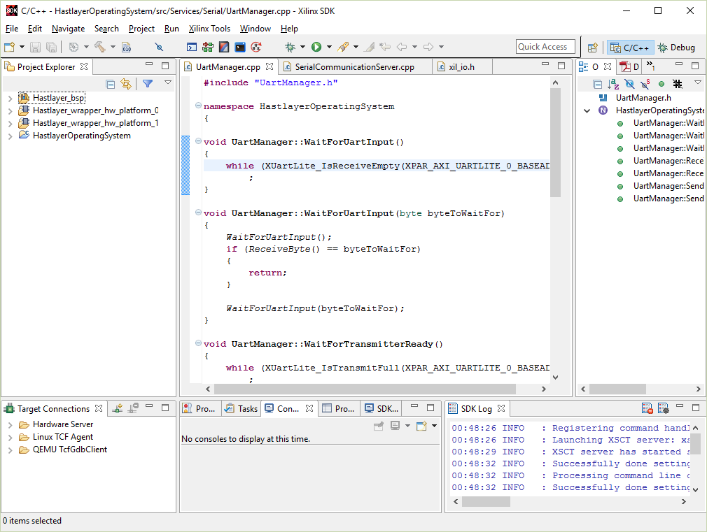

# Getting started

The purpose of this document is to get you started with the following topics:

- generating and opening the Vivado project (which can be used to generate the bitstream for the FPGA),
- generating and opening the SDK workspace (which contains the software projects to be run on the MicroBlaze soft CPU core),

We use the TCL-based approach for keeping a minimum set of required files under version control.

## Generating the Vivado project with batch file (mkproject.bat)

Run `mkproject.bat` which will open Vivado, and generate the project files in the `project` subdirectory.

Once the project has been generated, you can re-open it next time by entering the `project` subdirectory and opening `Hastlayer.xpr`.

> The project subdirectory will not be checked into version control, it only contains all the temporary files needed for editing and compiling the project and its corresponding IP cores.

## Generating the Vivado project manually

If the *Create file associations* option is not selected while installing Vivado, `mkproject.bat` might not work. In any case, you can open Vivado and type the following into the TCL console to open the project:

    cd C:/path-to-my-project/hastlayer-hardware
    source mkproject.tcl

(Do not forget that we have to use the slash '/' inside the paths here, instead of the Windows default backslash.)

## Generating the SDK workspace with batch file (mksdk.bat)

To start the Xilinx SDK, you will have to *Generate bitstream* in Vivado, wait until the process ends, and choose *Export → Export Hardware*.
In the dialog that appears, choose the `SDK` folder in the root of the repository, then click OK.

For the first time, you will have to run `mksdk.bat` from the root of the repository, which will create the workspace in the `sdk` directory, and it will also import the projects into it.

Close any program that may lock the SDK folder, including Explorer, if you receive the following error:

    Moving SDK folder...
    Access is denied.
            0 dir(s) moved.

You should run `mksdk.bat` only once. The next time you can open the workspace by launching Xilinx SDK from Vivado (but make sure you have set the directories correctly):

You will have to press OK at the Xilinx SDK *Workspace Launcher* screen, and then close the welcome screen:

Now you are ready to develop with the Xilinx SDK:

If you run into problems while building a project, try this:
1. Right click on the project in *Project Explorer*.
2. Select *Change Referenced BSP*.
3. Select *Hastlayer_bsp* in the popup window.
4. Press OK.
5. Clean and rebuild the project.

## Generating the SDK workspace manually

If `mksdk.bat` accidentally fails, you create the workspace manually:

Launch Xilinx SDK from Vivado, selecting the the `sdk` folder as your workspace.

Import the projects:

If you get a lot of build errors, you have to set the references for each project correctly.

- All of the application projects (including `HastlayerOperatingSystem`) should have to reference the BSP.
- The BSP has to reference the Hardware Platform.

	HastlayerOperatingSystem  \
	Ethernet_cpp              ----- >  Hastlayer BSP ---> Hastlayer Hardware Platform
	Ethernet_bare_cpp         /

To do this, right click on each and every application project, and select *Change referenced BSP*, then click OK.

Then right click the BSP project and open up the *Properties* window for it:

On the *Project References* page, check the reference for `Hastlayer_wrapper_hw_platform_0` (and uncheck all others).

Right click the BSP project and *Re-generate BSP Sources*:

Then clean all projects, and re-build them. The errors should be gone.