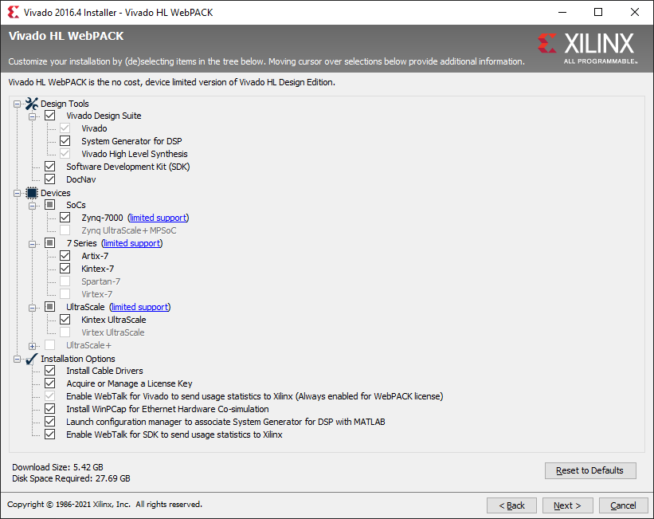

# Prerequisite requirements

On this page you can find the system requirements and necessary preparations for creating a design in Vivado for the Nexys4DDR development board.

## Hardware requirements

On the [Xilinx memory recommendations](http://www.xilinx.com/design-tools/vivado/memory.htm) site you can find Xilinx FPGA's memory requirements for various OS. On the Nexys4DDR board there is an XC7A100T FPGA, for which Xilinx recommends 3 GB of memory (Windows, 64 bit OS).

## Software requirements

Use Vivado **2016.4 (64-bit)** and the corresponding Xilinx Software Development Kit (SDK). Some notes:

- Use exactly the above version. No other version, be it newer or older, will be compatible.
- You can download the WebPACK version of Vivado for free from [Xilinx's website](https://www.xilinx.com/support/download.html).
- Install Vivado under a path without special characters or spaces and also put your projects under similarly simple paths! Otherwise a lot of things will mysteriously fail in Vivado (e.g. with the TCL error "TclStackFree: incorrect freePtr. Call out of sequence?") and also in Xilinx SDK. You can also use symlinks to provide such a path to an otherwise problematic one.
- During installation select everything you can to install.

	

## Digilent Nexys 4 DDR board files installation

Download the **Nexys 4 DDR board files** from [Vivado Board Files for Digilent 7-Series FPGA Boards](https://reference.digilentinc.com/vivado:boardfiles2015).

Follow the instructions in the description (merge the contents of the downloaded .zip file with the existing Vivado board files; it can be found under a path like C:\Xilinx\Vivado\2016.4\data\boards\board_files\). Now you should be able to choose the Nexys 4 DDR board in Vivado when you create a new project.