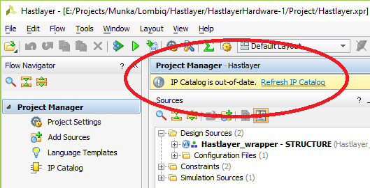
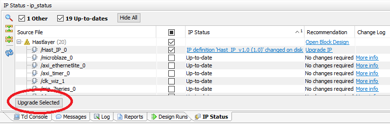
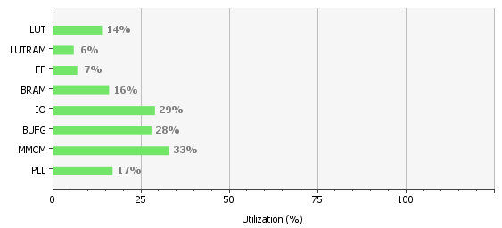
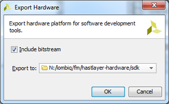
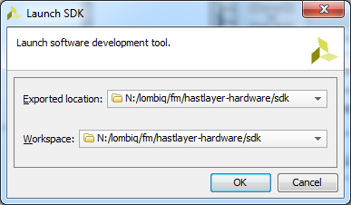
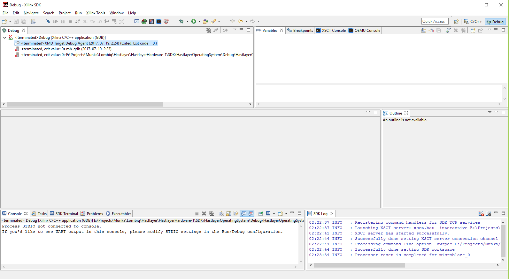

# Running hardware designs

If you've completed the [Getting started](GettingStarted.md) guide you're ready to run the sample or your custom implementations generated by Hastlayer. You'll need to do these steps in Vivado, after opening the already generated Vivado project.

## Updating the hardware design (running your custom hardware designs)

Try the automated approach first:

1. Generate the hardware description with the .NET component of Hastlayer. Make sure to configure it to write out the VHDL source code to a file as in the samples.
2. Once the file is created locate the source file that you'll need to overwrite with it in the Hardware repo's clone: It's under *IPRepo\Hast_IP.vhd* on the file system (this contains the `PrimeCalculator` sample by default). (IP means "intellectual property" here, as in "IP core", i.e. self-contained hardware component).
3. Overwrite the file the the generated one (or you can configure Hastlayer to save the file straight to that location).
4. Run the *UpdateDesign.bat* script to update the hardware design with the newly generated *Hast_IP.vhd* and generate the corresponding FPGA configuration bitstream.

If the script fails for some reason you can do the same manually:

1. Open the Vivado project.
2. Generate the hardware description with the .NET component of Hastlayer. Make sure to configure it to write out the VHDL source code to a file as in the samples.
3. Once the file is created locate the source file that you'll need to overwrite with it in the Hardware repo's clone: It's under *IPRepo\Hast_IP.vhd* on the file system (this contains the `PrimeCalculator` sample by default). (IP means "intellectual property" here, as in "IP core", i.e. self-contained hardware component).
4. Overwrite the file the the generated one (or you can configure Hastlayer to save the file straight to that location).
5. Vivado will notice that the file has changed and show you an "IP Catalog is out-of-date" message. Click "Refresh IP Catalog" there. If you don't see this message then that means Vivado didn't recognize the change; in this case edit *Hast_IP.vhd* (just adding and removing any character, then saving the file is enough), that should do the trick.

	

6. Once the IP Catalog is refreshed you'll need to upgrade the IP by clicking "Upgrade Selected" in the IP Status window that appears at the bottom of the screen.

	

7. After the upgrade is done Vivado will ask you to generate output products for the project, so do so. This will take a bit.
8. Once done with this you can generate the bitstream from the design; this will be loaded onto the FPGA to configure it. Do so by selecting "Generate Bitstream" from under Flow/Generate Bitstream or from the bottom of the left-hand "Flow Navigator" pane. 

Bitstream generation will take a while, depending on the complexity of the design it can be as long as an hour or more. Once it's completed you can follow up with the next section. But first make sure that the the design will fit on the FPGA: Post-Implementation resource utilization (check it in the Project Summary window that will open after bitstream generation) should be below 80% (or 60% if you want to play safer) for every kind of resource except DSPs, which should be below 100%. As a baseline the Hastlayer Hardware Framework itself takes about this much resources (with the Loopback sample):

**If you cancel bitstream generation then always purge/re-clone the hardware repository and re-create the project!** Otherwise parts of the previous hardware design will remain stuck in Vivado and you'll get incorrect results.

## Running the hardware design

Once the bitstream is generated you need to program the FPGA with the hardware design before being able to launch the SDK project.

If you're using a Nexys 4 DDR board then for this to work some jumpers on your board need to be set correctly (but these come like this, so should already be the same):

- JP1/MODE: QSPI (left)
- JP2: SD (top)
- JP3: USB (left)

Try the automated approach first:

1. Connect the FPGA via USB with the supplied cable and don't forget to turn it on with the on-board switch.
2. Run the *RunDesign.bat* script.

This will launch the Xilinx SDK from where you can start the program on the FPGA that'll listen to input and dispatch it to the generated hardware component. Follow up with the guide below.

If the script fails for some reason you can do the same manually:

1. Connect the FPGA via USB with the supplied cable and don't forget to turn it on with the on-board switch.
2. Click "Open Hardware Manager" (Flow/Hardware Manager or from the bottom of the left-hand "Flow Navigator" pane), then "Open target", select "Auto connect" and let the board be auto-detected.
3. Load the hardware design onto the FPGA by doing the following: Right click on the listed FPGA and select "Program Device", then click "Program".
4. Export the design to the SDK from under File/Export/Export Hardware. Tick "Include bitstream" and choose the project's generated *SDK* folder as the destination.

	

5. Launch the SDK from under File/Launch SDK. Select the previously used *SDK* folder for both "Exported location" and "Workspace".

	

	Follow up with the guide below.

Once the SDK is running do the following:

1. Launch the embedded software on the FPGA to make it listen to input:
	1. Select Run/Debug Configurations.
	2. Select the existing configuration named "Debug" under "Xilinx C/C++ application (GDB) and click the "Debug" button. If that's inactive then build the `HastlayerOperatingSystem` project (although this should happen automatically): Right click on the project and select "Build Project".
3. The program will start running on the FPGA and you'll even be able to set breakpoints and see the application's state in the debugger. You should see the SDK's Debug perspective:

	

4. Now you can start the host component of Hastlayer from Visual Studio and invocations on hardware entry points will be transferred to the FPGA. If this is the first time you run a hardware design after setting up Hastlayer check if the SDK program is indeed running on the FPGA by clicking the Suspend (pause) button. The program's execution should properly halt at one point, after which you can resume it (if there are issues with the program it won't pause and you'll get some error message).