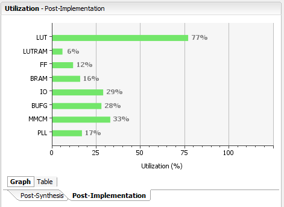

# Running hardware designs

If you've completed the [Getting started](GettingStarted.md) guide you're ready to run the sample or your custom implementations generated by Hastlayer. You'll need to do these steps in Vivado, after opening the already generated Vivado project.

## Updating the hardware design (running your custom hardware designs)

Note: if you're running the sample from a freshly created Vivado projects you can jump straight to the next section.

1. Open the Vivado project.
2. Let Hastlayer's host component generate the hardware first. Make sure to configure it to write out the VHDL source code to a file.
3. Once the file is created locate the source file that you'll need to overwrite with it in the Hardware project: It's under *IPRepo\Hast_IP.vhd*. (IP means "intellectual property" here, as in "IP core", i.e. self-contained hardware component).
4. Overwrite the file the the generated one (or you can configure Hastlayer to save the file straight to that location).
5. Vivado will notice that the file has changed and show you an "IP Catalog is out-of-date" message. Click "Refresh IP Catalog" there.

6. Once the IP Catalog is refreshed you'll need to upgrade the IP by clicking "Upgrade Selected" in the IP Status window that appears at the bottom of the screen.

7. After the upgrade is done Vivado will ask you to generate output products for the project, so do so. This will take a bit.
8. Once done with this you can generate the bitstream from the design; this will be loaded onto the FPGA. Do so by selecting "Generate Bitstream" from under Flow/Generate Bitstream or from the bottom of the left-hand "Flow Navigator" pane. 
9. Bitstream generation will take a while, depending on the complexity of the design it can be as long as an hour or more. Once it's completed you can follow up with the next section. But first make sure that the the design will fit on the FPGA: Post-Implementation resource utilization (check it in the Project Summary window that will open after bitstream generation) should be below 80% for every kind of resource.

## Running the hardware design

Once the bitstream is generated you need to program the FPGA with the hardware design before being able to launch the SDK project.

1. Connect the FPGA via USB with the supplied cable (don't forget to turn it on), click "Open Hardware Manager" (Flow/Hardware Manager or from the bottom of the left-hand "Flow Navigator" pane), then "Open target", select "Auto connect" and let the board be auto-detected.
2. Load the hardware design onto the FPGA by doing the following: Right click on the listed FPGA and select "Program Device", then click "Program".
3. Export the design to the SDK from under File/Export/Export Hardware. Tick "Include bitstream" and choose the project's generated *SDK* folder as the destination.

4. Launch the SDK from under File/Launch SDK. Select the previously used *SDK* folder for both "Exported location" and "Workspace".

6. Build the project in the SDK. This should happen automatically, but if not, right click on the `HastlayerOperatingSystem` project and select Build Project.
7. Now you can launch the embedded software on the FPGA to make it listen to input:
	1. Select Run/Debug Configurations.
	2. Select the existing configuration named "Debug" under "Xilinx C/C++ application (GDB).
8. The program will start running on the FPGA and you'll even be able to set breakpoints and see the application's state in the debugger.
9. Now you can start the host component of Hastlayer from Visual Studio and invocations on hardware entry points will be transferred to the FPGA.