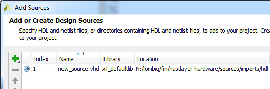
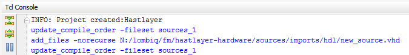
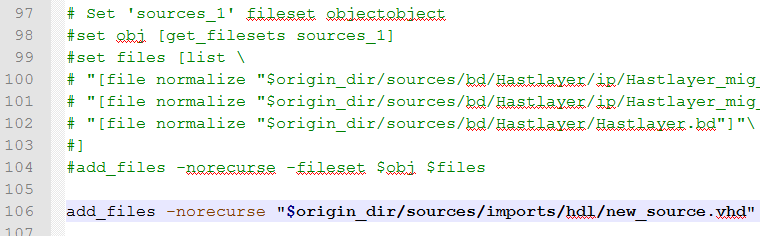

# Version control

The TCL-based approach to keep the minimum set of files under version control has been selected because the XPR project and its associated files change frequently (even from opening and recompiling the project).

## Committing changes

You have to take different actions when different parts of the project change:

- If the files or ports of Hast IP change, you will have to regenerate `component.xml` by repackaging the IP core in the Vivado subproject of the IP core.
- If the block design changes (IP cores are added/removed or the topology changes):
    - Open the block design in Vivado
    - Select *File → Export → Export Block Design*
    - Change the export path to overwrite the existing mkbd.tcl in the root of the repo. For example: change from *N:/lombiq/fm/hastlayer-hardware/project/Hastlayer.tcl* to *N:/lombiq/fm/hastlayer-hardware/mkbd.tcl*.
- If new files have been added to the project itself, you first have to check the Vivado TCL window in order to see the executed TCL commands, and add these to the `mkproject.tcl` file manually. Let's see an example:
    - We're adding a file called `new_source.vhd` to our project through the *Add Sources* wizard of Vivado.  
    
    - We see this in the TCL console:  
    
    - We add the file to the project by adding the correct command to `mkproject.tcl`:  
    
- If the C/C++ project changes in the SDK, you have nothing to do.

## Pulling changes

- If *mkbd.tcl* or *mkproject.tcl* changes you have to delete the *Project* folder and re-run *mkproject.bat*. If anything else changes in the hardware design then you'll just need to regenerate the bitstream. If the IP is re-packaged you'll need to either regenerate the Vivado and SDK projects (after purging or re-cloning the Hardware repo) or manually upgrade Hast_IP (in Vivado go to Tools/Report/Report IP Status, then after Hast_IP is listed in the IP Status window as changed you'll need to follow the steps under [this page](RunningHardwareDesigns.md).
- If the C/C++ project changes in the SDK, you have nothing to do.